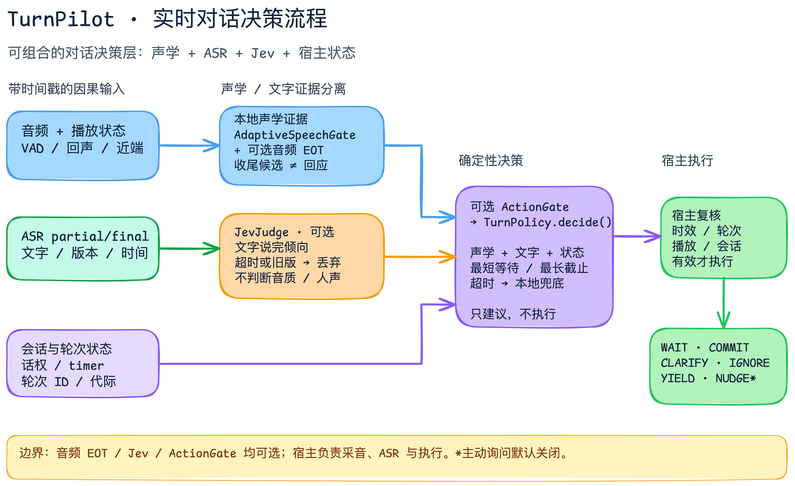
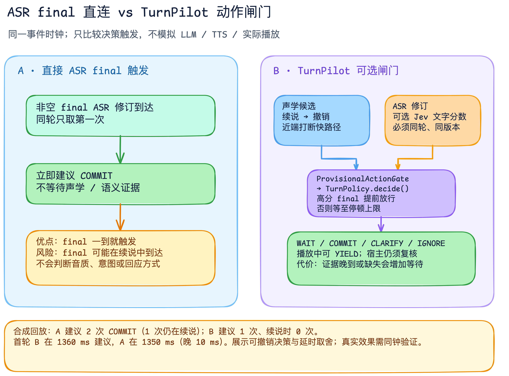

# TurnPilot

**让语音 Agent 更懂得何时开口。**

[English](README.md) · [文档](docs/README.md) · [参与开发](CONTRIBUTING.md) · [许可证](LICENSE)

[](https://github.com/chicogong/turnpilot/actions/workflows/quality.yml)   

TurnPilot 把“检测到停顿”升级为**有证据、可撤销、有截止时间的会话决策**。动态声学观察与可选终点候选跟踪停顿和续说；可选的 **Jev** 从当前 ASR 文字判断想法是否完整、是否需要澄清、是否只是附和；动作闸门把它们与播放和轮次状态合在一起，建议等待、回应、澄清、忽略或让出话权。

它是可组合的决策层：宿主继续掌管麦克风、ASR、LLM、TTS 和播放，TurnPilot 专注于**什么时候行动、采取哪种行动**。

## 为什么值得用

- **为避免过早抢话而设计：**停顿先成为候选；用户一续说就撤销，而不是把每个 ASR final 当成回应指令。
- **不只判断“说完”：**Jev 提供文字侧的完整度、含义澄清、附和与回应需求分数；音质和近端人声仍由声学侧判断。
- **实时路径有边界：**ASR 修订与 Jev 结果必须同轮、同版本、及时到达；宿主提供新鲜声学观察时，可按最长停顿上限本地兜底。用户打断助手不等 Jev。
- **动作可解释：**纯策略返回 `WAIT`、`COMMIT`、`CLARIFY`、`IGNORE`、`YIELD` 等建议和原因；宿主复核后执行。

## 决策链路



[可编辑 Excalidraw 源文件](docs/diagrams/turnpilot-decision-flow.excalidraw) · [SVG](docs/diagrams/turnpilot-decision-flow.svg)。声学、文字和宿主状态使用同一时钟；可选动作闸门只作决策建议，真正的播放与取消仍由宿主控制。

## 从 ASR final 到会话决策

ASR 告诉我们识别出了什么，却不能仅凭一条 final 修订决定**用户是否仍在续说、助手该不该回应、该澄清还是该让出话权**。TurnPilot 让 final ASR 成为证据之一，而不是直接的执行命令。



[可编辑 Excalidraw 源文件](docs/diagrams/asr-vs-turnpilot.excalidraw) · [SVG](docs/diagrams/asr-vs-turnpilot.svg)。图中的“直接 ASR”特指每轮第一条非空 final 修订立即触发一次回应的最小基线，并不代表所有 ASR 应用。

## 安装与最小示例

需要 Python 3.10–3.13。在本仓库执行：

```bash
python -m pip install -e .
```

```python
from turnpilot import AcousticSignal, AudioQuality, HostState, TranscriptSignal, TurnPolicy, TurnRef

ref = TurnRef("demo-session", "turn-1", 0)
decision = TurnPolicy().decide(
    HostState(ref, now_ms=1000, session_active=True),
    AcousticSignal(
        ref,
        observed_at_ms=1000,
        speech_active=False,
        pause_duration_ms=640,
        audio_quality=AudioQuality.CLEAR,
    ),
    TranscriptSignal(ref, available_at_ms=900, revision=1, text="hello", is_final=True),
)
print(decision.kind.value)  # commit_user_turn
```

示例只用合成观察，不调用网络。真正执行建议前，宿主还必须复核会话、轮次/代际、有效期及动作对应的播放状态。

## 用真实音频做同钟对照

`turnpilot-file-run` 按实时节奏逐个送入 32 ms 音频块，运行**本地 Silero VAD 与增量 Vosk ASR**，让直接 final-ASR、固定 640 ms、动态 640 ms 和候选动作闸门使用同一批观察进行对照。Jev 是可选、限次、可取消的文字侧分支。

```bash
python -m pip install -e '.[file]'
turnpilot-file-run corpus/window.wav \
  --vad-model corpus/models/silero.onnx \
  --asr-model corpus/models/vosk-model-small-cn-0.22 \
  --report reports/window.json --trace reports/window.jsonl
```

自行取得有使用权的音频及模型，先创建 `reports/`。输入须为 16 kHz、单声道、PCM16，长度 32 ms–60 s；输出文件不覆盖已有内容。不录麦克风、不自动下载、不默认调用云端，也不在文件结束时伪造 final 或补静音。报告只有时间与状态，**不含逐字稿或音频**。一次文件是一段分析窗口，不是多轮 Agent；没有人工标签就不报告效果正确率。[配置、Jev 开关与读数说明](docs/file-run.md)。

## 使用 Jev：给 ASR 增加文字侧判断

安装可选依赖：`python -m pip install -e '.[jev]'`。在本地设置 `TYPESAFE_API_KEY` 环境变量后，下面的示例会**明确授权上传这句示例文字**，请求 Jev 的完整度、澄清、附和和回应需求分数：

```python
import asyncio
import os
import time

from turnpilot import TranscriptSignal, TurnRef
from turnpilot.jev import HttpxJevTransport, JevJudge


async def main() -> None:
    transport = HttpxJevTransport(os.environ["TYPESAFE_API_KEY"])
    try:
        now_ms = time.monotonic_ns() // 1_000_000
        transcript = TranscriptSignal(
            TurnRef("demo-session", "turn-1", 0),
            available_at_ms=now_ms,
            revision=1,
            text="明天下午三点提醒我开会",
            is_final=True,
        )
        signal = await JevJudge(transport, timeout_ms=1500).judge(
            transcript, now_ms=now_ms, allow_remote_text=True
        )
        print(signal.complete_probability, signal.clarification_probability)
    finally:
        await transport.close()


asyncio.run(main())
```

`signal` 是带轮次、修订和到达时间的**文字证据**，可交给 `TurnPolicy` 或可选动作闸门；它本身不代表音质清楚，也不直接命令助手开口。1500 ms 仅方便单次体验；实时链路应设置更短截止、限制调用次数，并保留本地兜底。[接口与安全边界](docs/architecture.md#jev-adapter-boundary) · [公开语料复核](docs/evaluation.md#current-public-data-checks-not-an-end-to-end-ab)

## 已验证的进展

- **续说可撤销：**在同钟的两轮合成回放中，直接 final-ASR 基线建议回应 2 次，其中 1 次发生在续说中；可选闸门只建议 1 次，并撤销了续说中的候选。首轮建议晚 10 ms。这验证了机制，不是用户体验指标。
- **Jev 确实提供文字侧筛选：**在 [Easy Turn](https://huggingface.co/datasets/ASLP-lab/Easy-Turn-Testset) 20 条真实录音对应的未完结文本中，现有 0.8 阈值放行 **0/20**；但完整文本也仅放行 **3/20**。这说明当前阈值过于保守，不能直接作为上线策略。40 次请求均成功，调用耗时详见[评测文档](docs/evaluation.md)。
- **声学还在优化：**6 段 [SmoothConv](https://huggingface.co/datasets/qualialabsAI/SmoothConv) 录音的小样本对照中，动态候选和固定 640 ms 门控都在 10 个续说停顿里过早截断 6 次，尚未证明声学收益。

TurnPilot 已具备可复现的决策契约、因果回放和安全边界；**真实连续对话的端到端提升仍需同钟流式 ASR、播放事件及人工动作标签验证**。完整数字、复现命令与局限见[评测方案](docs/evaluation.md)和[研究现状](docs/research.md)。

## 包含哪些能力

- 提供服务商无关的[决策契约与架构](docs/architecture.md)，把声学证据与文字/语义证据分开。
- 提供可选的[候选终点动作闸门与无原文回放](docs/standalone-action-replay.md)；不改变 `TurnPolicy` 默认行为。
- 提供有界本地音频评分运行时及需明确授权的 Jev 文字适配器；不附带模型权重，也不把文字评分当作音质证据。
- 提供离线[评估和证据工具](docs/evaluation.md)。仓库示例均为合成数据；[研究现状](docs/research.md)说明测到了什么、还缺什么。

本地验证：`uv sync --locked --extra dev`，再运行 `uv run --no-sync pytest -q`。完整质量门禁和隐私要求见[参与开发](CONTRIBUTING.md)。

## 发布边界

TurnPilot 的代码和原创文档采用 [Apache-2.0 许可证](LICENSE)；SVG 内嵌 Comic Shanns 字体另有 [MIT 声明](NOTICE)。这些许可不授予第三方模型、数据集或 Jev 服务的使用权。仓库不分发录音、逐字稿、凭证或第三方模型权重。可选 Jev 调用只有逐次明确授权才会上传文字。公开源码不代表已达到产品级质量，也不代表已证实真实对话效果提升。
